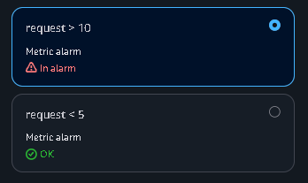
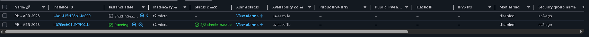

# Projeto - [ AWS / Teste de Escalabilidade ] - Infraestrutura AWS

## Visão Geral

Este projeto implementa uma arquitetura padrão na Amazon Web Services (AWS) para testar políticas de escalonamento automático em um ambiente controlado. A infraestrutura utiliza uma Virtual Private Cloud (VPC) com sub-redes públicas e privadas, um Classic Load Balancer para gerenciar o tráfego e instâncias EC2 configuradas com auto scaling para avaliar o comportamento de escalonamento com base em métricas de requisições.

## Arquitetura

- **Virtual Private Cloud (VPC):** A infraestrutura é hospedada em uma VPC padrão com 4 sub-redes: 2 públicas e 2 privadas, garantindo isolamento e segurança da rede.
- **Sub-redes Públicas:** Hospedam o Classic Load Balancer, que distribui o tráfego de entrada para as instâncias EC2 nas sub-redes privadas.
- **Sub-redes Privadas:** Contêm instâncias EC2 configuradas para testes, acessíveis apenas via Load Balancer.
- **Classic Load Balancer:** Gerencia o tráfego de entrada, direcionando requisições para as instâncias EC2 nas sub-redes privadas.
- **Instâncias EC2:** Uma instância EC2 inicial é provisionada em uma sub-rede privada para testes, com possibilidade de escalonamento.
- **Grupo de Auto Scaling:** Configurado com políticas de escalonamento para adicionar 1 instância quando as requisições excederem 10 por minuto e remover 1 instância quando as requisições caírem abaixo de 5 por minuto.

## Objetivo

O projeto visa testar e validar políticas de escalonamento automático, simulando cenários de variação de tráfego para garantir que a infraestrutura responda adequadamente a mudanças na demanda.

## Uso

- Os usuários acessam a aplicação de teste por meio da URL pública do Classic Load Balancer.
- O sistema ajusta automaticamente o número de instâncias EC2 com base nas políticas de escalonamento definidas, permitindo análise do comportamento em diferentes níveis de tráfego.

## Pré-requisitos

- Conta na AWS com permissões para gerenciar VPC, EC2, Load Balancer e Auto Scaling.
- Conhecimento básico dos serviços AWS mencionados.
- Ferramentas como AWS CLI ou Console de Gerenciamento da AWS para configuração.

## Passo a Passo de Implementação

### Passo 1: Configuração e Criação da VPC

- Primeiro, acesse o serviço de VPC no Console AWS.
  

- Configure a VPC inicial:

  - Escolha a opção "VPC and more" para criar uma VPC completa com sub-redes e recursos associados.
  - Defina o nome da VPC como "escalamento-vpc" e habilite a geração automática de tags.
  - Configure o bloco de CIDR IPv4 como "10.0.0.0/16" para determinar o intervalo de IPs da VPC.
  - Opte por "None" para NAT Gateways, pois as sub-redes privadas não requerem acesso direto à internet neste estágio.
  - Habilite "Enable DNS hostnames" e "Enable DNS resolution" para suportar resolução de nomes dentro da VPC.
    
    

- Revisão e Criação:
  - Revise a configuração no modo "Preview" para garantir que todos os recursos (VPC, sub-redes, tabelas de rotas e Internet Gateway) estejam corretamente definidos.
  - Clique em "Create VPC" para finalizar a criação.

### Passo 2: Configuração e criação das Security Groups

- Acesse a seção de Security Groups no Console AWS.
  

- Crie o Security Group para o Classic Load Balancer:

  - Clique em "Create security group".
  - Insira o nome "clb-sgp" e a descrição "classic load balancer security group".
  - Selecione a VPC "escalamento-vpc".
    

- Crie o Security Group para a instância EC2:

  - Clique em "Create security group".
  - Insira o nome "ec2-sgp" e a descrição "ec2 security group".
  - Selecione a VPC "escalamento-vpc".
    

- Configure as regras de entrada (inbound rules) para a EC2:

  - Adicione uma regra para SSH (porta 22) de qualquer origem (0.0.0.0/0).
  - Adicione uma regra para HTTP (porta 80) do Security Group do Load Balancer ("sgp" como fonte).
  - Salve as alterações.

  

- Configure as regras de saída (outbound rules) para a EC2:

  - Edite as regras de saída e adicione uma regra para permitir todo o tráfego TCP (portas 0-65535) para qualquer destino (0.0.0.0/0).
  - Salve as alterações.
    

- Configure as regras de entrada (inbound rules) para o Load Balancer:

  - Edite as regras de entrada e adicione uma regra para permitir tráfego HTTP (porta 80) de qualquer origem (0.0.0.0/0).
  - Salve as alterações.
    

- Configure as regras de entrada (inbound rules) para a Load Balancer:

  - Edite as regras de saída e adicione uma regra para permitir o tráfego HTTP apenas para o security group do EC2
  - Salve as alterações.
    

### Passo 3: Configuração e criação do Classic Load Balancer

- Acesse a seção de Load Balancers no Console AWS.
  

- Crie o Classic Load Balancer:

  - Clique em "Create" na seção "Classic Load Balancer".
  - Escolha a opção "Classic Load Balancer" para aplicações existentes na rede EC2-Classic.
    

- Configure as opções básicas e mapeamento de rede:
  - Insira o nome do load balancer como "lb-escalamento".
  - Selecione o esquema "Internet-facing" para permitir acesso público.
  - Escolha a VPC "escalamento-vpc".
  - Adicione as sub-redes públicas "escalamento-vpc-subnet-public1-us-east-1a" e "escalamento-vpc-subnet-public2-us-east-1b" nas zonas de disponibilidade us-east-1a e us-east-1b, respectivamente.
  - Escolha o security group criado anteriormente
  - E clique em Create Classic Load Balancer
    
    

### Passo 4: Configuração e criação do Launch Template

- Acesse a seção de instâncias EC2 no Console AWS e clique em "Launch instances".
  

- Configure o tipo de instância e escolha o sistema operacional:

  - Insira o nome do launch template como "escalamento-lt".
  - Selecione o tipo de instância "t2.micro" (1 vCPU, 1 GiB de memória).
  - Escolha o sistema operacional Amazon Linux.
    

- Configure as configurações de rede:

  - Selecione a sub-rede privada "escalamento-vpc-subnet-private-1-us-east-1a".
  - Escolha o security group existente "ec2-sg" para controlar o tráfego da instância.
    

- Defina o user data:

  - Insira os dados do usuário (user data) com um script bash para instalar um servidor web simples e exibir o hostname.
    

user_data.sh:

```
#!/bin/bash
yum update -y
yum install -y httpd
echo "Hello World" > /var/www/html/index.html

cat <<EOL > /var/www/html/teste
#!/bin/bash
echo "Content-type: text/plain"
echo ""
echo "Requisição recebida em $(hostname)"
sleep 5
EOL

chmod +x /var/www/html/teste
systemctl start httpd
systemctl enable httpd
```

- Crie e salve o launch template:
  - Revise as configurações e clique em "Create launch template" para finalizar.

### Passo 5: Configuração e criação do Auto Scaling

- Acesse a seção de Auto Scaling Groups no Console AWS e clique em "Create Auto Scaling group".

  

- Configure o launch template e defina um nome:

  - Insira o nome "ats-escalamento"
  - Selecione o launch template "escalamento-lt" criado anteriormente.
  - Escolha a versão mais recente do template.
    

- Defina a vpc e as sub-redes do Auto Scaling Group:

  - Selecione a vpc criada anteriormente e as sub-redes privadas "escalamento-vpc-subnet-private-1-us-east-1a" e "escalamento-vpc-subnet-private-2-us-east-1b" para o grupo.
    

- Associar o Load Balancer ao Auto Scaling:

  - Defina o load balancer como classic e selecione o criado anteriormente.
    

- Configure a quantidade miníma e máxima de instâncias:

  - Defina como desired 1, min 1 e max 3.
    

- Revise e crie o Auto Scaling Group:
  - Revise todas as configurações (nome, sub-redes, capacidade).
  - Clique em "Create Auto Scaling group" para finalizar a criação.

### Passo 5: Configuração e Criação de Alarmes e Políticas de Escalonamento

- Acesse a seção de CloudWatch no Console AWS e clique em "Alarms" seguida de "Create alarm".

  

  

- Escolha a métrica para o alarme:

  - Selecione a métrica "RequestCount" do Classic Load Balancer "lb-escalamento". (É NECESSÁRIO TER FEITO ALGUMAS REQUESTS NO CLB PARA APARECER ESSA OPÇÃO)
    

- Defina as condições do alarme de escala para cima:

  - Crie um alarme para disparar quando a soma das requisições por minuto exceder 10 por um período de 1 minutos consecutivos.
    
    

- Defina as condições do alarme de escala para baixo:

  - Configure um segundo alarme para disparar quando a soma das requisições por minuto cair abaixo de 5 por um período de 1 minutos consecutivos.
    
    

- Revise e crie os alarmes:

  - Clique em "Create alarm" para finalizar a criação de ambos os alarmes.

- Agora voltamos para o nosso auto scaling e clicamos em Automatic scaling

  - Clicamos em Create dynamic scaling policy
    

- Definimos uma politica de adicionar uma instância quando o alarme de alto que criamos anteriormente alertar
  

- Definimos uma politica de remover uma instância quando o alarme de baixo que criamos anteriormente alertar  
  

- Revise e crie as políticas:

  - Clique em "Create" para finalizar a criação de ambas politicas.

### Passo 6: Teste

- Primeiro iniciamos com apenas 1 instância por padrão do auto scaling

  

- Simulamos algumas requisições para disparar o alerta alto

  

- Esperamos alguns minutos e em seguida o alerta vai disparar e a instancia nova irá começar a subir

  
  

- E esperamos alguns minutos e em seguida para o número de requisições ficar abaixo de 5 e o alarme baixo disparar, removendo uma máquina

  
  
